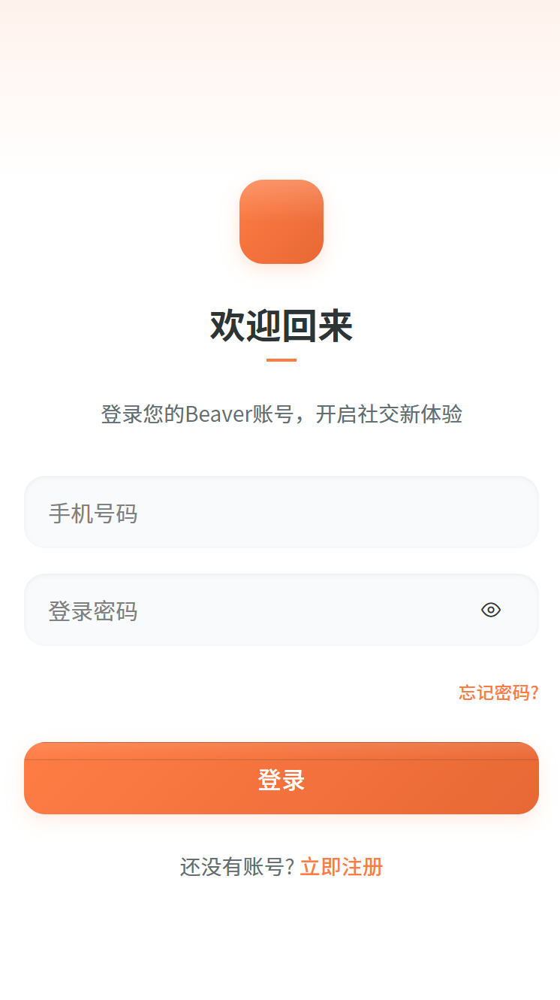
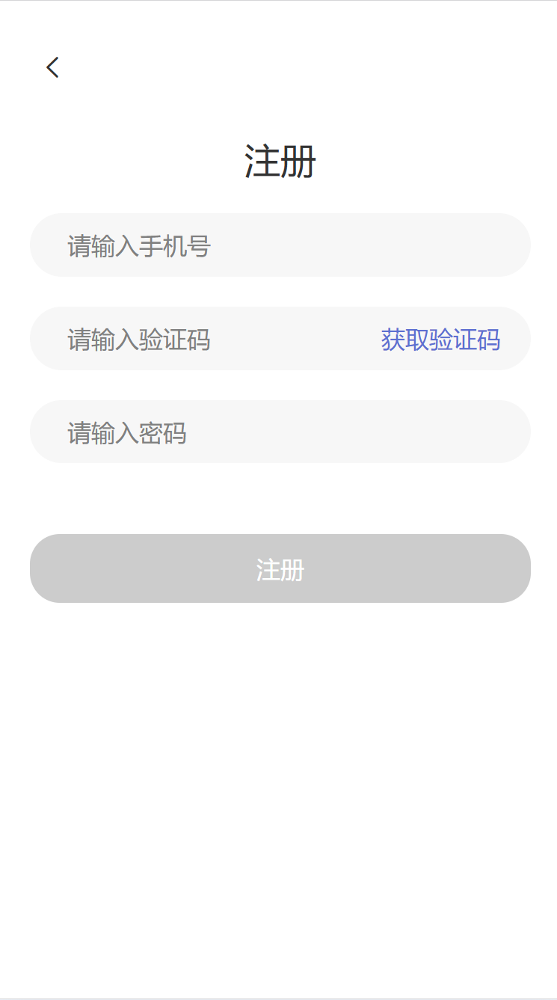
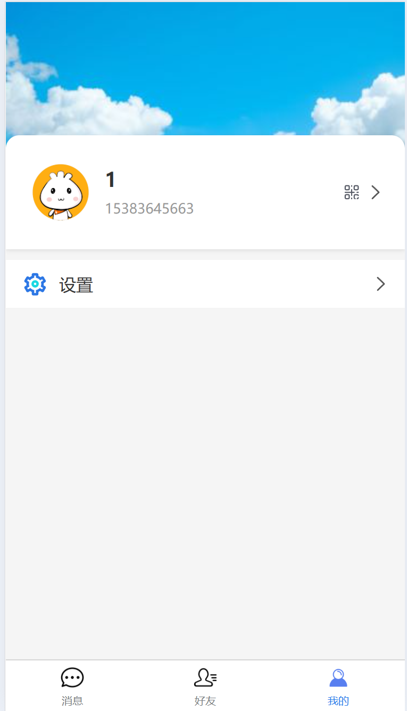
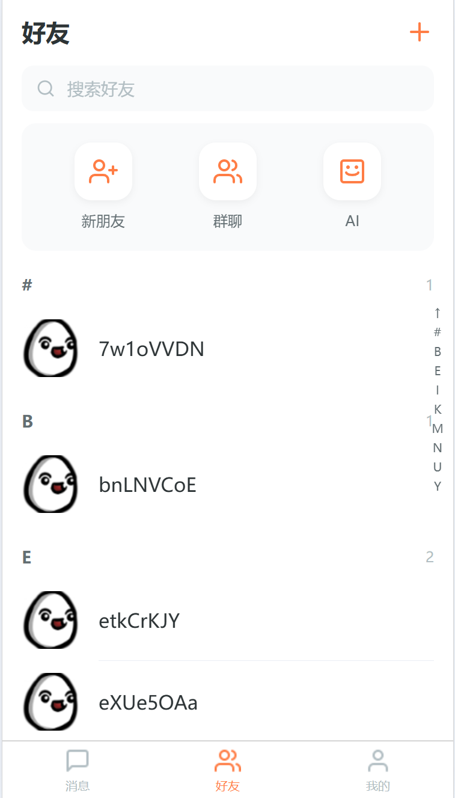
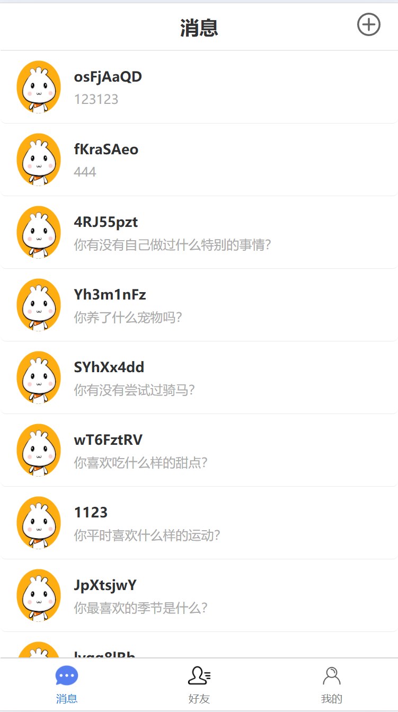
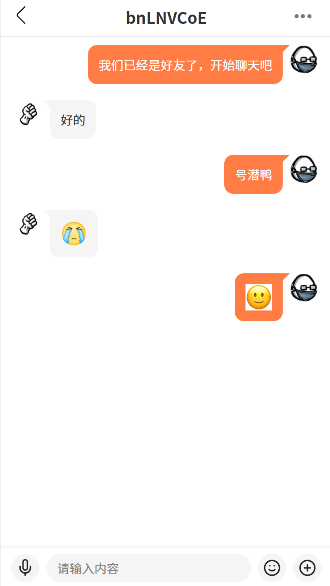
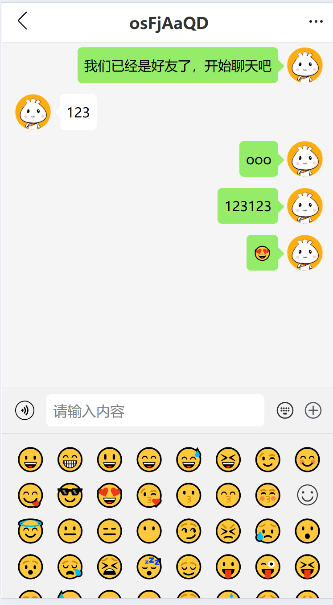
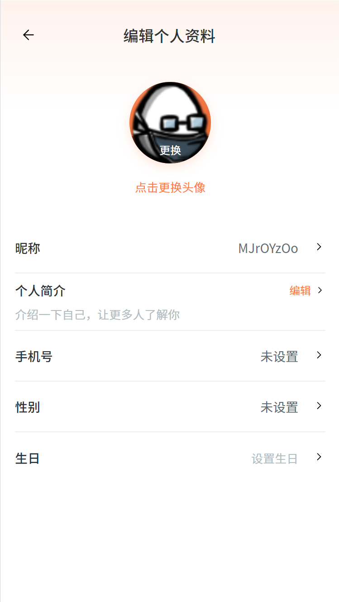

# 海狸IM

### 项目介绍
+ 本项目是利用工作之余做的一个聊天IM。
+ 这是项目的第一个版本历时2个月， 前端使用uniapp， 后端使用go-zero
+ 如果喜欢可以点一个star
+ 加入QQ群：[](https://qm.qq.com/q/82rbf7QBzO)（1013328597）


### uniapp启动命令
```
node版本: 20
npn install
npm run build_test

执行完成在uniapp客户端启动
```

### 项目列表
| [GitHub仓库]    |  说明                                                                                      
| ------------------------------------------------------------ | --------------------------------------------------------------------------
| [beaver-server](https://github.com/wsrh8888/beaver-server)               | 后端服务  |
| [beaver-mobile](https://github.com/wsrh8888/beaver-mobile)        | uniapp客户端 |


### 应用截图

登录界面


注册界面界面


我的界面


我的二维码


好友列表


消息页面


聊天页面


聊天页面


详情页面



