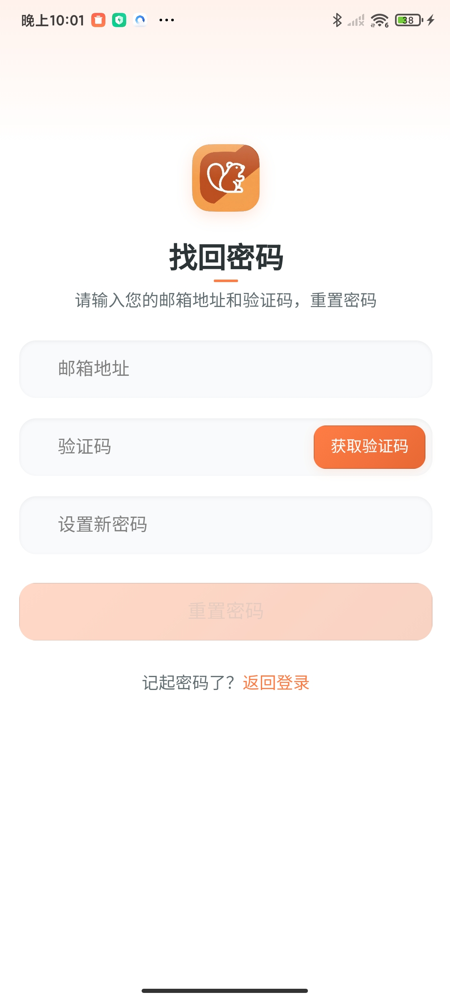
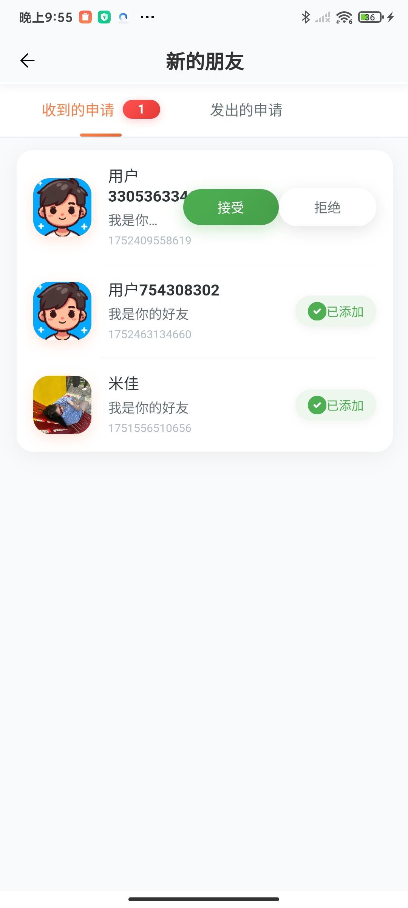
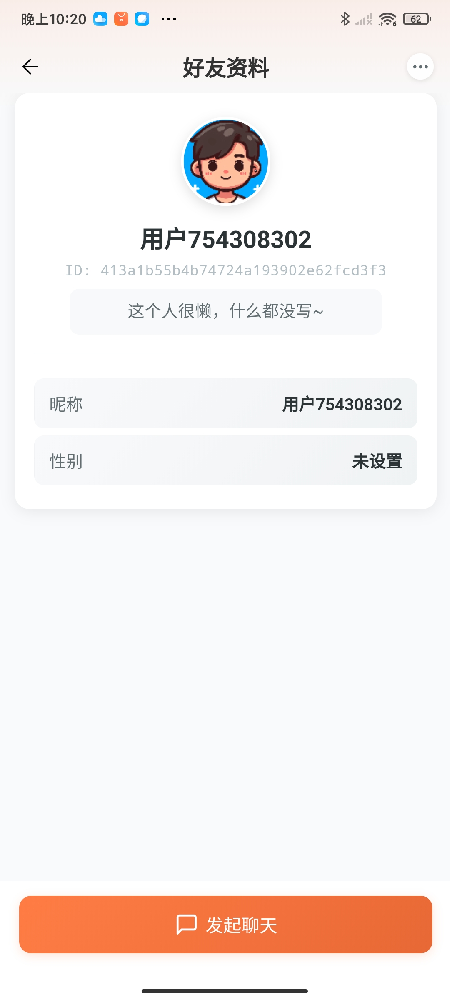
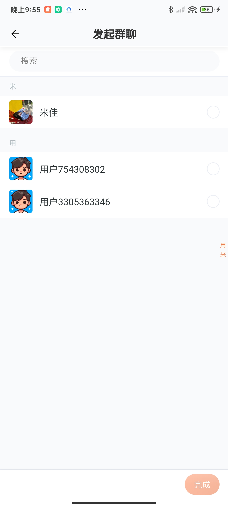
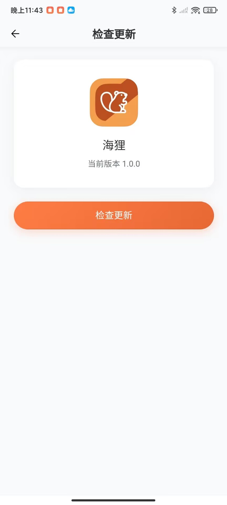
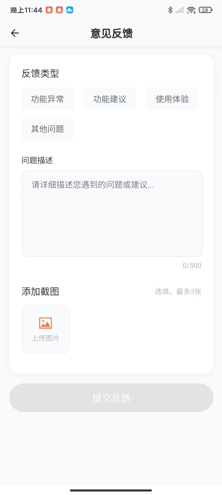
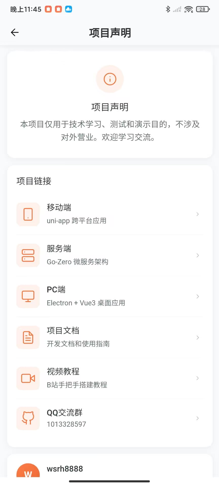

# 🦫 Beaver IM - 海狸即时通讯

[](LICENSE)
[](https://nodejs.org/)
[](https://vuejs.org/)
[](https://golang.org/)
[](https://qm.qq.com/q/82rbf7QBzO)

> 🚀 基于 Vue3 + UniApp + Go-Zero 构建的现代化即时通讯应用，支持移动端、桌面端多平台

## 📖 项目简介

Beaver IM 是一个功能完整的即时通讯应用，采用现代化的技术栈构建。项目包含移动端（UniApp）、桌面端（Electron）和后端服务（Go-Zero），为用户提供流畅的聊天体验。

### ✨ 核心特性

- 🔐 **安全认证** - 用户注册、登录、密码找回
- 👥 **社交功能** - 好友管理、群聊、二维码添加
- 💬 **即时通讯** - 私聊、群聊支持文本、图片、表情
- 🖼️ **多媒体支持** - 图片发送、头像上传（七牛云）
- 📱 **多端同步** - 移动端、桌面端数据实时同步
- 🔄 **实时通信** - WebSocket 长连接保证消息实时性
- 🎨 **现代化UI** - 简洁美观的用户界面

## 🛠️ 技术栈

### 前端技术
- **Vue 3** - 渐进式 JavaScript 框架
- **UniApp** - 跨平台应用开发框架
- **Pinia** - 状态管理
- **TypeScript** - 类型安全

### 后端技术
- **Go-Zero** - 微服务框架
- **WebSocket** - 实时通信
- **MySQL** - 数据存储
- **Redis** - 缓存和会话管理

### 桌面端
- **Electron** - 跨平台桌面应用框架

## 🚀 快速开始

### 环境要求

- Node.js >= 20.0.0
- Go >= 1.21
- MySQL >= 8.0
- Redis >= 6.0

### 安装步骤

1. **克隆项目**
```bash
git clone https://github.com/wsrh8888/beaver-mobile.git
cd beaver-mobile
```

2. **安装依赖**
```bash
npm install
```

3. **构建项目**
```bash
npm run build_test
```

4. **启动开发**
```bash
# 在 UniApp 客户端中导入项目并运行
```

### 后端服务

请参考 [beaver-server](https://github.com/wsrh8888/beaver-server) 仓库进行后端服务部署。

## 📱 功能展示

### 🔐 用户认证
<div align="center">
  
  
  
</div>

### 💬 聊天功能
<div align="center">
  
  
  
</div>

### 👥 社交功能
<div align="center">
  
  
  
</div>

### 👤 个人中心
<div align="center">
  
  
  
</div>

### 🎯 其他功能
<div align="center">
  
  
  
  
  
</div>

## 📚 项目结构

```
beaver-mobile/
├── src/
│   ├── api/           # API 接口
│   ├── component/     # 公共组件
│   ├── pages/         # 页面组件
│   ├── pinia/         # 状态管理
│   ├── static/        # 静态资源
│   ├── types/         # TypeScript 类型定义
│   ├── utils/         # 工具函数
│   └── ws-manager/    # WebSocket 管理
├── static/            # 静态资源
└── unpackage/         # 打包输出
```

## 🔗 相关项目

| 项目 | 仓库地址 | 说明 |
|------|----------|------|
| **beaver-server** | [GitHub](https://github.com/wsrh8888/beaver-server) / [Gitee](https://gitee.com/dawwdadfrf/beaver-server) | 后端服务 |
| **beaver-mobile** | [GitHub](https://github.com/wsrh8888/beaver-mobile) / [Gitee](https://gitee.com/dawwdadfrf/beaver-mobile) | 移动端应用 |
| **beaver-desktop** | [GitHub](https://github.com/wsrh8888/beaver-desktop) / [Gitee](https://gitee.com/dawwdadfrf/beaver-desktop) | 桌面端应用 |

## 📖 文档与教程

- 📚 **详细文档**：[Beaver IM 文档](https://wsrh8888.github.io/beaver-docs/)
- 🎥 **视频教程**：[B站教程](https://www.bilibili.com/video/BV1HrrKYeEB4/)
- 📱 **演示包下载**：[v1.0.0 APK](https://github.com/wsrh8888/beaver-docs/releases/download/v1.0.0/1.0.0.apk)

## 🤝 贡献指南

我们欢迎所有形式的贡献，包括但不限于：

- 🐛 Bug 报告
- 💡 功能建议
- 📝 文档改进
- 🔧 代码贡献

### 贡献步骤

1. Fork 本仓库
2. 创建特性分支 (`git checkout -b feature/AmazingFeature`)
3. 提交更改 (`git commit -m 'Add some AmazingFeature'`)
4. 推送到分支 (`git push origin feature/AmazingFeature`)
5. 开启 Pull Request

## 📄 开源协议

本项目基于 [MIT](LICENSE) 协议开源。

## 🆘 获取帮助

- 📧 邮箱：[751135385@qq.com]
- 💬 QQ群：[1013328597](https://qm.qq.com/q/82rbf7QBzO)
- 📚 文档：[Beaver IM 文档](https://wsrh8888.github.io/beaver-docs/)
- 🎥 教程：[B站视频教程](https://www.bilibili.com/video/BV1HrrKYeEB4/)

## ⭐ 支持项目

如果这个项目对你有帮助，请给我们一个 ⭐ Star！

---

<div align="center">
  <strong>Made with ❤️ by Beaver IM Team</strong>
</div>


