# 🦫 Beaver IM - Instant Messaging

[](LICENSE)
[](https://vuejs.org/)
[](https://uniapp.dcloud.io/)
[](https://www.typescriptlang.org/)
[](https://qm.qq.com/q/82rbf7QBzO)

> 🚀 **Modern Instant Messaging Application** - Built with Vue3 + UniApp, supporting mobile and desktop platforms, providing a complete social chat experience

[English](README_EN.md) | [中文](README.md)

---

## ✨ Core Features

- 🔐 **Secure Authentication** - User registration, login, password recovery
- 💬 **Instant Messaging** - Private chat, group chat with text, images, emojis
- 👥 **Social Features** - Friend management, QR code adding, moments
- 🖼️ **Multimedia Support** - Image sending, avatar upload (Qiniu Cloud)
- 📱 **Multi-platform Sync** - Real-time data sync between mobile and desktop
- 🔄 **Real-time Communication** - WebSocket long connection ensures message real-time
- 🎨 **Modern UI** - Clean and beautiful user interface

## 🛠️ Tech Stack

- **Vue 3** - Progressive JavaScript framework
- **UniApp** - Cross-platform app development framework
- **TypeScript** - Type safety
- **Pinia** - State management
- **WebSocket** - Real-time communication

## 📱 Feature Showcase

### 🔐 User Authentication
<div align="center">
  
  
  
</div>

### 💬 Chat Features
<div align="center">
  
  
  
  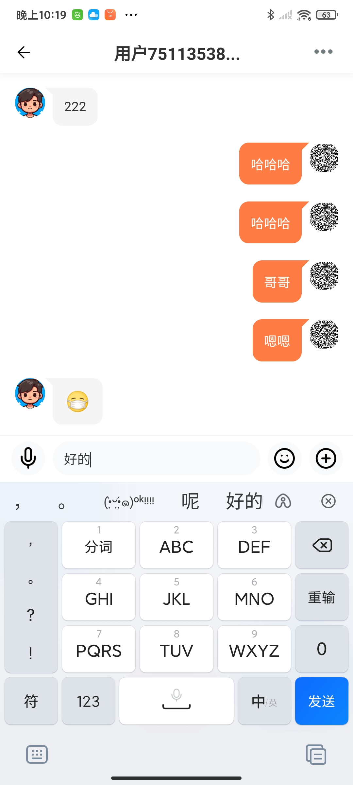
  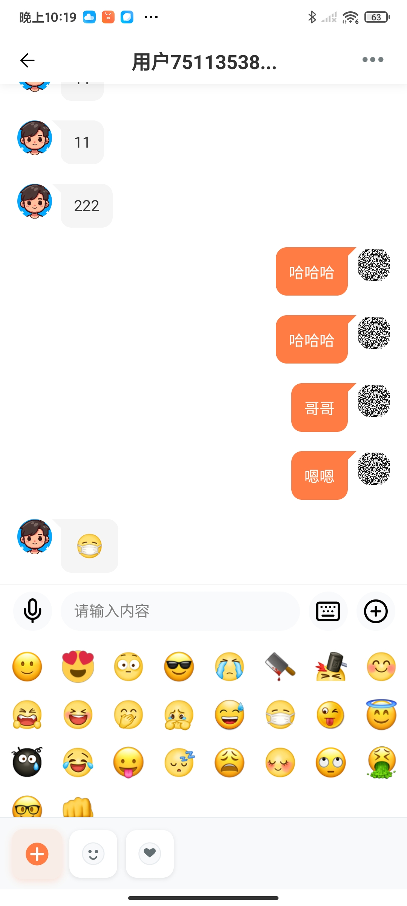
  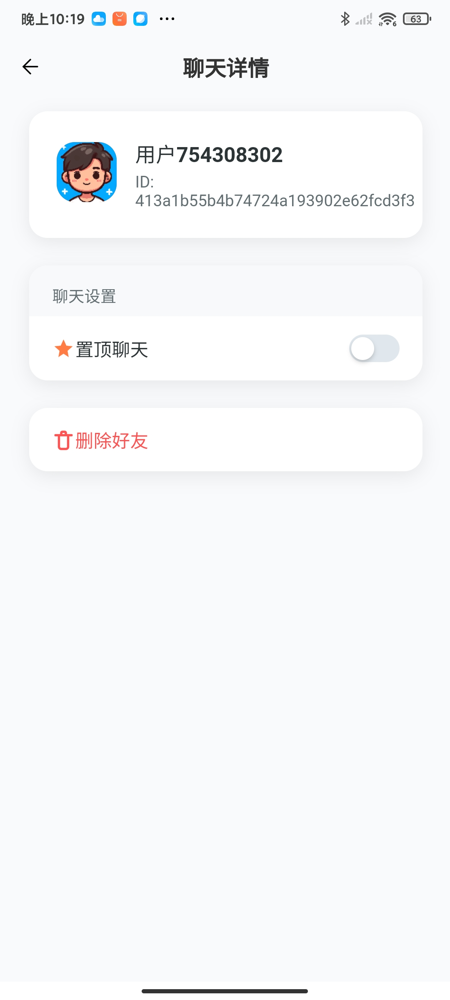
</div>

### 👥 Social Features
<div align="center">
  
  
  
  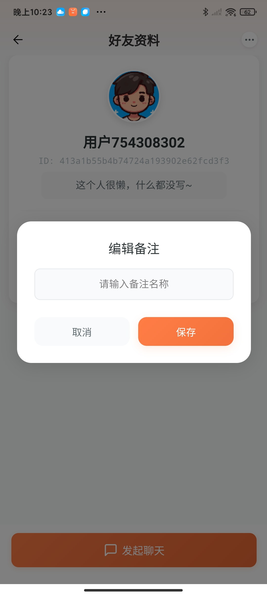
</div>

### 🏠 Moments & Groups
<div align="center">
  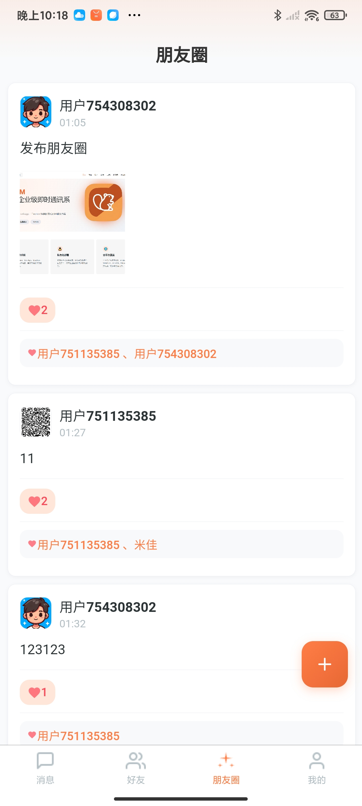
  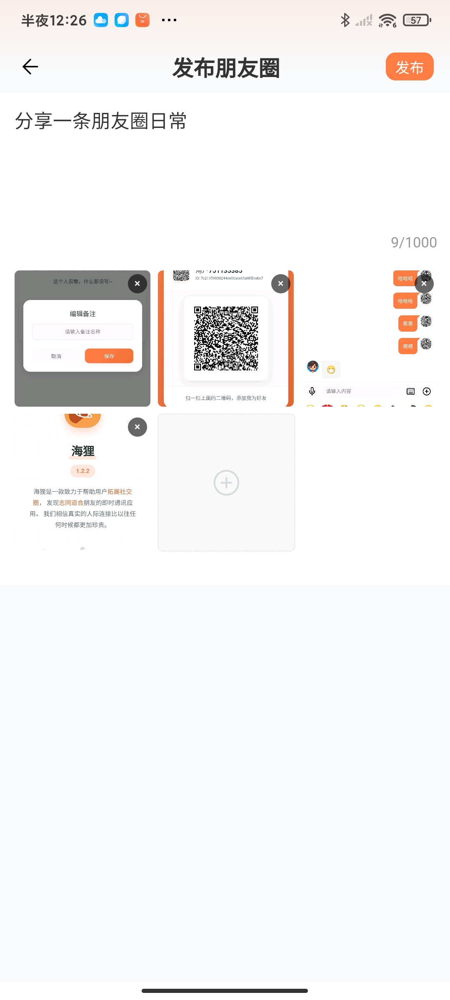
  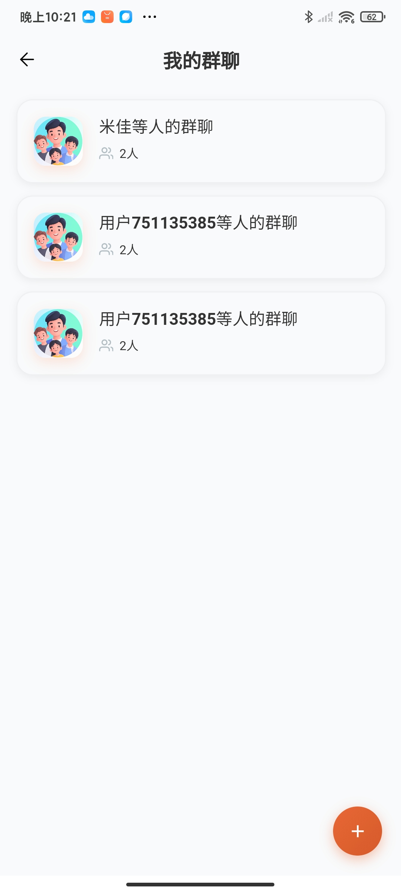
  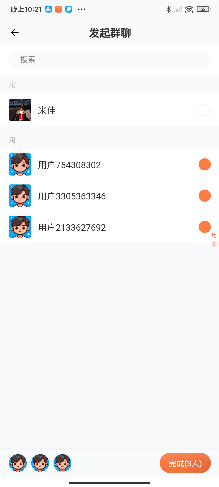
  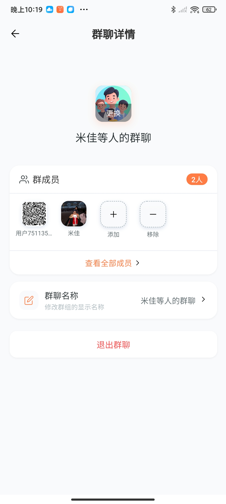
  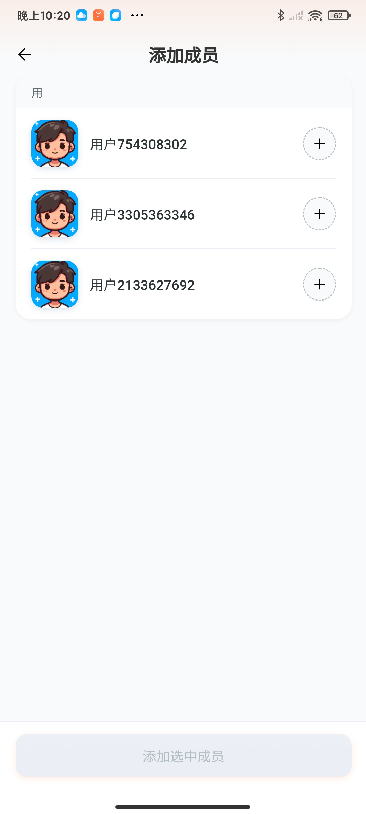
</div>

### 👤 Personal Center
<div align="center">
  
  
  
</div>

### ⚙️ System Features
<div align="center">
  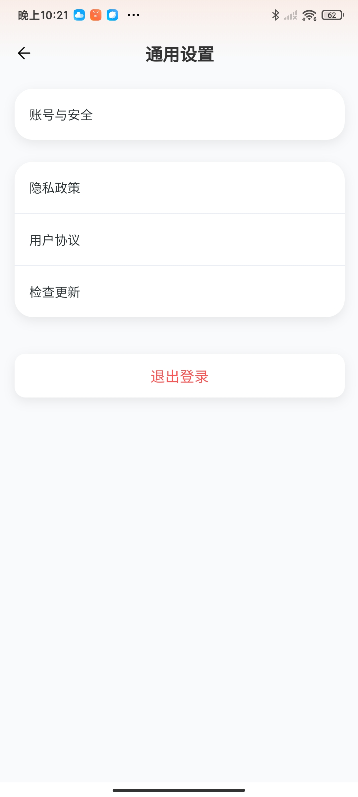
  
  
  
  
</div>

## 🚀 Quick Start

### Requirements
- Node.js >= 20.0.0

### Installation Steps
```bash
# Clone project
git clone https://github.com/wsrh8888/beaver-mobile.git
cd beaver-mobile

# Install dependencies
npm install

# Build project
npm run build_test

# Import project in UniApp client and run
```

## 🔗 Related Projects

| Project | Repository | Description |
|---------|------------|-------------|
| **beaver-server** | [GitHub](https://github.com/wsrh8888/beaver-server) / [Gitee](https://gitee.com/dawwdadfrf/beaver-server) | Backend Service |
| **beaver-mobile** | [GitHub](https://github.com/wsrh8888/beaver-mobile) / [Gitee](https://gitee.com/dawwdadfrf/beaver-mobile) | Mobile App |
| **beaver-desktop** | [GitHub](https://github.com/wsrh8888/beaver-desktop) / [Gitee](https://gitee.com/dawwdadfrf/beaver-desktop) | Desktop App |

## 📚 Documentation & Resources

- 📖 **Detailed Documentation**: [Beaver IM Docs](https://wsrh8888.github.io/beaver-docs/)
- 🎥 **Video Tutorial**: [Bilibili Tutorial](https://www.bilibili.com/video/BV1HrrKYeEB4/)
- 📱 **Experience Package Download**: [Beaver IM Android Experience Package](https://github.com/wsrh8888/beaver-docs/releases/download/lastest/latest.apk)

## 🤝 Contributing

We welcome all forms of contributions!

1. Fork this repository
2. Create a feature branch (`git checkout -b feature/AmazingFeature`)
3. Commit your changes (`git commit -m 'Add some AmazingFeature'`)
4. Push to the branch (`git push origin feature/AmazingFeature`)
5. Open a Pull Request

## 🆘 Get Help

- 💬 QQ Group: [1013328597](https://qm.qq.com/q/82rbf7QBzO)
- 📚 Documentation: [Beaver IM Docs](https://wsrh8888.github.io/beaver-docs/)
- 🎥 Tutorial: [Bilibili Video Tutorial](https://www.bilibili.com/video/BV1HrrKYeEB4/)

## 📄 License

This project is licensed under the [MIT](LICENSE) License.

## ⭐ Support Project

If this project helps you, please give us a ⭐ Star!

## ☕ Buy Me a Coffee

If this project helps you, welcome to buy me a coffee ☕

<div align="center">
  
  
</div>

---

<div align="center">
  <strong>Made with ❤️ by Beaver IM Team</strong>
</div> 